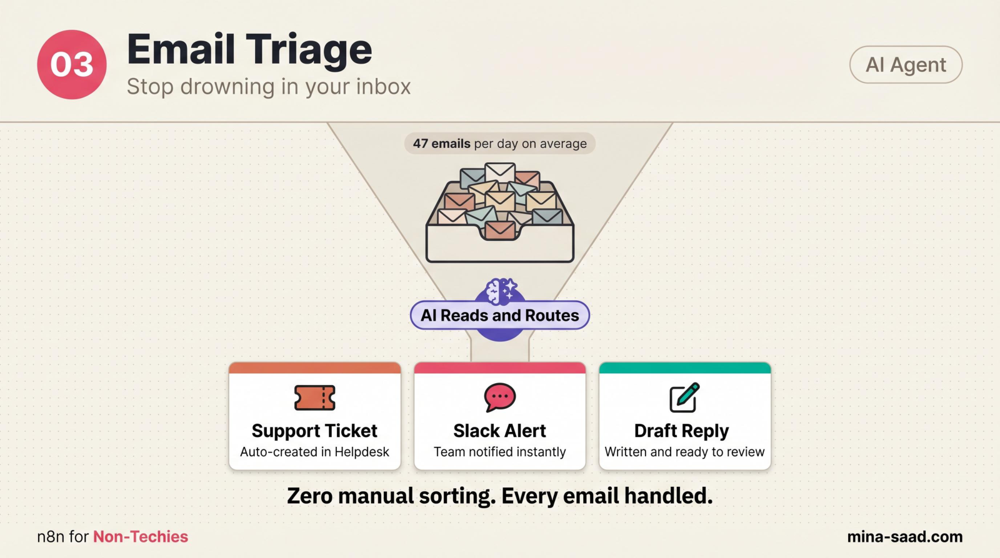

# n8n Email Triage Agent

   

> Stop opening every email twice. A Gmail-polling n8n workflow that classifies every incoming message with Claude, drafts a reply for the ones worth answering, and pings Slack on the urgent ones. You review a list of drafts. You don't triage.

> Part of the **[n8n-ai-agents catalog](https://github.com/MinaSaad1/n8n-ai-agents)**. See the catalog for shared [architecture principles](https://github.com/MinaSaad1/n8n-ai-agents/blob/main/docs/architecture-principles.md), [security framework](https://github.com/MinaSaad1/n8n-ai-agents/blob/main/docs/security-framework.md), and [output conventions](https://github.com/MinaSaad1/n8n-ai-agents/blob/main/docs/output-conventions.md) every template in the collection follows.



---

## What it does

- Polls Gmail every 5 minutes for unread inbox messages
- Extracts sender, subject, and body into a normalized shape
- Sends the email to Claude Sonnet 4.6 with a single prompt that returns category, priority, one-line summary, draft reply, and a label suggestion as JSON
- Creates a Gmail draft addressed to the sender, ready for you to review and send
- If priority is `high`, also posts a Slack alert with sender, subject, summary, and category

## Architecture

```
Gmail (poll unread, every 5 min)
        │
        ▼
Extract Email Fields  ─── Set node, normalize {from, subject, body, date, email_id}
        │
        ▼
Triage + Draft Reply  ─── LangChain LLM chain
        │                  uses Claude Sonnet 4.6, returns JSON
        ▼
Parse Triage Response ─── Code node, JSON.parse + merge with email fields
        │
        ├──────────────────────────────┐
        ▼                              ▼
Create Gmail Draft           Is Urgent? (priority == high)
                                       │
                                       ▼
                              Slack Urgent Alert
```

Eight nodes plus a sticky README. One LLM call per email, one draft per email, one Slack ping only when priority is high. Polling is deliberate, see [`docs/ARCHITECTURE.md`](docs/ARCHITECTURE.md) for why.

## Requirements

> **Note**: cost and latency figures below were measured on Claude Haiku 4.5. The workflow now ships with Claude Sonnet 4.6 as the default, which is more capable and more expensive. Select a Haiku model in the node's model dropdown to get back to the numbers quoted here.


- **n8n** >= 1.78 (cloud or self-hosted)
- **Gmail account** with OAuth2 credentials configured in n8n (read + draft + modify scopes)
- **Anthropic API key** for Claude Sonnet 4.6 (model id: `claude-sonnet-4-6`)
- **Slack workspace** with a bot user and a channel for urgent alerts (optional, only if you want priority pings)
- **Reasonable inbox volume**. See the cost note in [`docs/SECURITY.md`](docs/SECURITY.md). At ~50 emails/day expect ~3 to 10 USD/month in Claude costs.

## Quickstart

### 1. Clone

```bash
git clone https://github.com/MinaSaad1/n8n-email-triage.git
cd n8n-email-triage
```

### 2. Set up the Gmail credential

Create a Gmail OAuth2 credential in n8n. Use the minimal scope set: `gmail.readonly`, `gmail.modify`, `gmail.compose`. Do not grant `gmail.full` or `mail.google.com`. The workflow only needs to read inbox messages and write drafts, nothing else.

### 3. Import the workflow

1. n8n -> **Workflows** -> **Import from File**
2. Select [`workflows/01-email-triage.json`](workflows/01-email-triage.json)
3. Open the imported workflow

### 4. Create the remaining credentials

| Node | Credential | Notes |
|---|---|---|
| `Gmail Poll Unread`, `Create Gmail Draft` | Gmail OAuth2 (named `Gmail`) | Same credential reused on both nodes. Minimal scope only. |
| `Claude Triage Model` | Anthropic API (named `Anthropic`) | Use a key dedicated to this workflow so spend is easy to attribute. |
| `Slack Urgent Alert` | Slack OAuth2 (named `Slack`) | Bot needs `chat:write`. Invite the bot to the alert channel before activating. |

### 5. Customize categories and prompt

Open the **Triage + Draft Reply** node. The default category list is:

```
support, billing, sales_inquiry, partnership, spam, personal, urgent, newsletter, other
```

Replace these with categories that match your actual inbox. Add a sentence or two of voice guidance to the prompt so drafts sound like you, not like a generic assistant. Keep the JSON output schema unchanged, the downstream Code node depends on it.

### 6. Set the Slack channel

In `Slack Urgent Alert`, replace `YOUR_SLACK_CHANNEL_ID` with the channel ID (not name) where you want urgent pings. Channel ID lives at the bottom of the channel details panel in Slack.

### 7. Test, then activate

Send yourself a test email from an external address. Run the workflow once with **Execute Workflow** and confirm:

- A Gmail draft appears in your Drafts folder addressed to the sender
- The Code node output includes a sensible `category`, `priority`, and `one_line_summary`
- If you forced `priority: high` in the test email subject, a Slack message arrives in the alert channel

Then activate the workflow. The Gmail trigger starts polling every 5 minutes.

## Configuration

- **Different polling interval**: edit `Gmail Poll Unread`. Five minutes is a reasonable default. Going below 1 minute risks Gmail API rate limits and gives Claude more emails to process per cycle.
- **Different model**: swap the Anthropic model in `Claude Triage Model`. Sonnet 4.6 is the cost/quality sweet spot for triage. Sonnet 4.6 is overkill for classification but fine if you also want long, contextual draft replies.
- **More routing channels**: add a Switch node after `Parse Triage Response` keyed on `category`, with one Slack node per channel (support, sales, billing, etc.). The current template only routes urgents.
- **Auto-archive spam**: add a Gmail node after the Switch branch for `category == spam` that calls `messages.modify` with `removeLabelIds: ['INBOX']`. Read the prompt-injection note in [`docs/SECURITY.md`](docs/SECURITY.md) before turning this on, you do not want a malicious sender talking the model into auto-archiving real complaints.
- **Log to Airtable or a sheet**: add a final node after `Parse Triage Response` that writes one row per email with category, priority, summary, and timestamp. Useful for "did the model classify Tuesday's batch correctly?" without scrolling executions.

## Troubleshooting

| Symptom | Cause | Fix |
|---|---|---|
| Workflow runs but no draft created | Same email keeps re-triggering because Gmail poll filter is `unread` and you never opened the original | Open or label the email manually, or add a final Gmail `addLabel` step that applies `n8n-triaged` so the trigger filter excludes it on the next poll. |
| Claude returns invalid JSON | Email body contained instructions that confused the model, or model output was truncated | The Code node falls back to `{category: 'other', priority: 'medium', ...}` to keep the flow alive. Check executions for the raw `text`, then increase `maxTokens` in `Claude Triage Model` or tighten the prompt. |
| Gmail draft addressed to the wrong recipient | `from` header parsing returned a display name without an email | Edit `Create Gmail Draft` -> `sendTo` to wrap the value: `={{ $json.from.match(/<(.+)>/)?.[1] || $json.from }}`. |
| Slack ping never fires | IF node sees `priority` as a string, comparison case-sensitive | Confirm Claude is returning lowercase `high`. The IF node has `caseSensitive: false` set, but a typo in the prompt schema could break it. |
| Bill spike on Anthropic | Inbox volume jumped, every email triggers one Haiku call | Set a budget cap in the Anthropic console, or pre-filter at the Gmail node with `query: 'from:-noreply'` to skip newsletters before they hit Claude. |
| `permission denied` on Gmail draft | OAuth scope is `readonly` only | Re-authorize the credential with `gmail.compose` added. |

## Security

Five things matter for this workflow:

1. **Gmail OAuth scope**: minimum viable scope, read + draft + modify only.
2. **Prompt injection through email body**: anything in the body is untrusted input; treat the model's classification as advisory, not authoritative.
3. **PII in email content**: don't log full bodies anywhere persistent.
4. **Mark-as-read behavior**: if the workflow errors mid-flow, the email could land in a half-processed state.
5. **Cost control on Claude**: high inbox volumes get expensive fast, set caps before activating.

Full threat model and layered defenses in [`docs/SECURITY.md`](docs/SECURITY.md).

## Roadmap

- [ ] Switch routing for category-based Slack channels (support, sales, billing) as an opt-in branch
- [ ] Optional Airtable logger for retroactive accuracy review
- [ ] Auto-label step after draft creation so triggers don't re-fire on retried emails
- [ ] Few-shot examples in the prompt for users with niche category vocabularies
- [ ] Outlook variant of the trigger node for non-Gmail inboxes

## License

MIT, see [LICENSE](LICENSE).

## Credits

Built by [Mina Saad](https://github.com/MinaSaad1). Part of the [n8n-ai-agents catalog](https://github.com/MinaSaad1/n8n-ai-agents).

---

## Need this running in your business?

This template is free and MIT, and it is meant to be forked. Getting one into
production against your real data, your credentials and your edge cases is a
different job, and it is the one I do.

I work out what is actually costing a business, then build whatever fixes it: an
AI agent, an automation, or a full application. Handed over so your team owns it.

[Book a call](https://cal.com/minasaad/60min) · [mina-saad.com](https://www.mina-saad.com)
